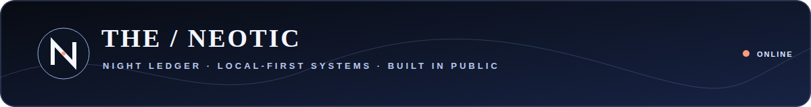
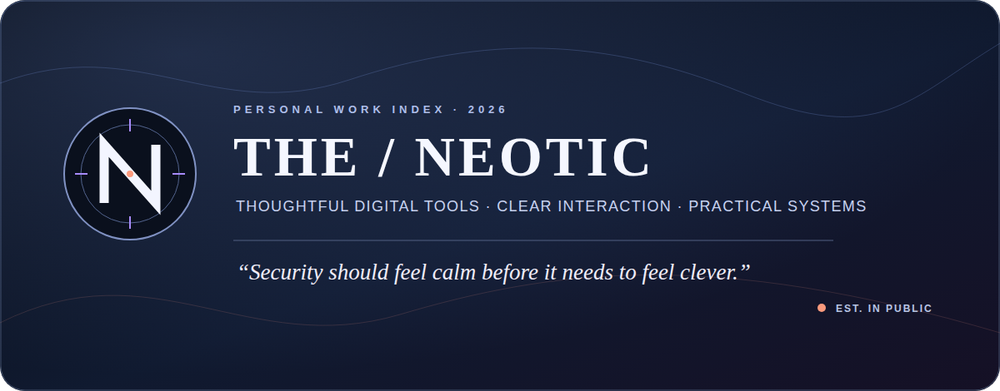
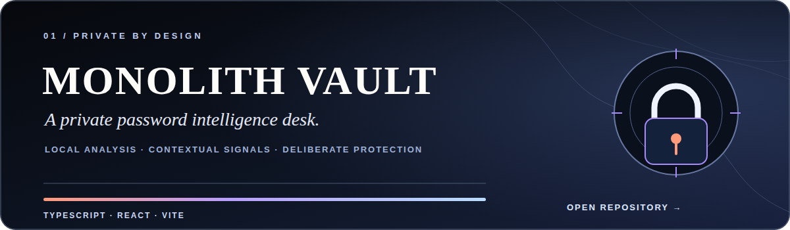
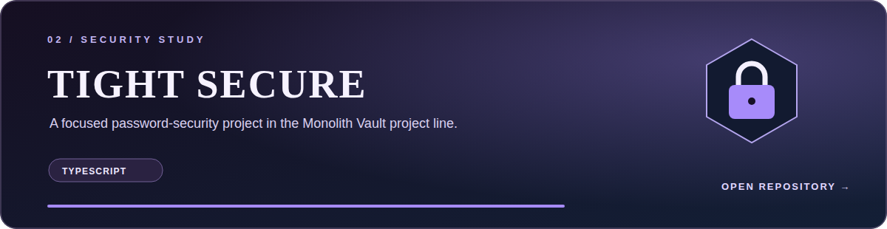
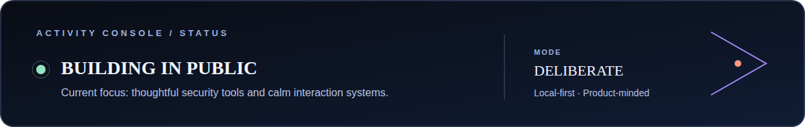
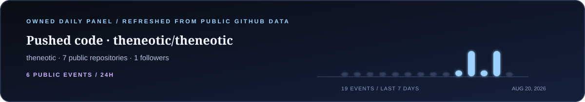
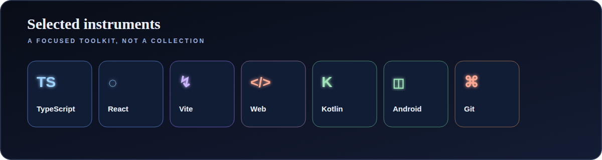

[README.md](https://github.com/user-attachments/files/31277858/README.md)

  

  

  <a href="https://github.com/theneotic?tab=repositories">EXPLORE REPOSITORIES</a>
  &nbsp;&nbsp;·&nbsp;&nbsp;
  <a href="https://github.com/theneotic/Monolith-Vault">MONOLITH VAULT</a>
  &nbsp;&nbsp;·&nbsp;&nbsp;
  <a href="https://github.com/theneotic/tight-secure">TIGHT SECURE</a>

 

### A considered approach

> I build local-first tools and calm interfaces for decisions that deserve a clearer signal. The goal is not noise or novelty—it is software that feels deliberate when it matters.

  <code>LOCAL-FIRST</code>&nbsp;&nbsp;
  <code>INTERACTION DESIGN</code>&nbsp;&nbsp;
  <code>PRODUCT SYSTEMS</code>&nbsp;&nbsp;
  <code>USEFUL DETAILS</code>

 

### Selected work

  

  

 

### Activity Console

  

  

  

The signal layer is static by design. The graph is live. The final panel is a repository-owned asset that you can choose to refresh once per day.

 
 

### Selected instruments

  

 

IN PROGRESS — BUILDING TOOLS WITH A REAL JOB TO DO.
