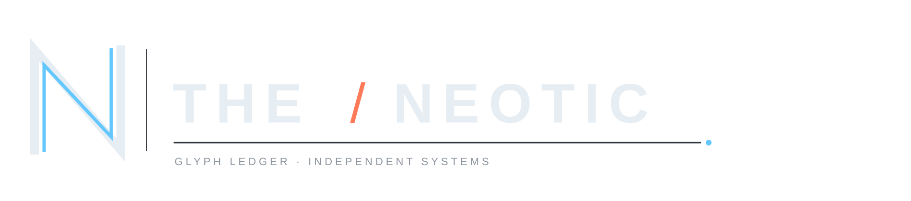
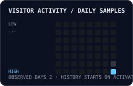

<code>THE / NEOTIC · SYSTEM ONLINE</code> BUILD · SECURE · OBSERVE

LOCAL-FIRST · SECURITY · INTERACTION · USEFUL SYSTEMS

   
   
  

---

## Route index

   
   
   
  

**Monolith Vault** — password intelligence and contextual strength analysis.  
**Ledgerly** — budget-management records and recurring rules.  
**Universal Backup** — focused backup-merging web interface.  
**LumenCraft Bedrock** — private Minecraft Bedrock shader and resource-pack add-on with performance profiles.

---

## Tech stack

OPEN A MODULE · CURATED FROM ACTIVE PUBLIC WORK

<strong>LANGUAGES</strong>

  
   
  
  
  

<strong>FRAMEWORKS + LIBRARIES</strong>

  
   
  
   
  

<strong>PLATFORM + OPERATIONS</strong>

  
   
  
  
  

---

## Signal ledger

<!-- PROFILE_RECORD:START -->
**Repositories** · [11](https://github.com/theneotic?tab=repositories)  
**Public stars** · `4`  
**Followers / following** · `4 / 3`  
**Leading language** · `TypeScript · 4 projects`  
**Visitor days observed** · `2` · starts from activation  
**Account established** · `2024-01-18`  
**Last refresh** · `2026-08-22 12:28 UTC`
<!-- PROFILE_RECORD:END -->

   
   
  

DAILY PUBLIC RECORD · BOUNDED TO THIS LEDGER

---

## Visitor activity heatmap

DAILY SAMPLES · HISTORY STARTS AFTER ACTIVATION

---

## Contribution trace

  <picture>
    <source media="(prefers-color-scheme: dark)" srcset="https://raw.githubusercontent.com/theneotic/theneotic/output/github-contribution-grid-snake-dark.svg" />
    <source media="(prefers-color-scheme: light)" srcset="https://raw.githubusercontent.com/theneotic/theneotic/output/github-contribution-grid-snake-light.svg" />
    
  </picture>

<a href="https://github.com/theneotic/theneotic/tree/output">CONTRIBUTION TRACE · GENERATED FROM PUBLIC GITHUB ACTIVITY</a>

---

## Featured systems

<code>PROJECT INDEX · PURPOSE-BUILT INTERFACES, OPEN SOURCE, DIRECT ENTRY</code>

### 

Password intelligence, contextual risk reading, and local-first interface work. 

### 

A TypeScript budget-management system with recurring rules and account-isolated records. 

### 

A TypeScript web route for bringing universal backup-merging work into one focused interface. 

### 

A private Minecraft Bedrock shader and resource-pack add-on with Android-focused performance profiles, PBR materials, luminous atmosphere, weather, audio, particles, and a companion behavior pack.

ALL ROUTES OPEN DIRECTLY IN GITHUB

---

## Signal board

   
   
  

<a href="https://github.com/theneotic">LIVE PUBLIC SIGNALS · LINKED TO SOURCE</a>

---

<strong>FIELD NOTES / OPEN WORKSPACE LOG</strong>

 

- **Profile:** [Open theneotic](https://github.com/theneotic)
- **Repositories:** [Browse all work](https://github.com/theneotic?tab=repositories)
- **Vault workspace:** [Open Monolith Vault](https://github.com/theneotic/Monolith-Vault)
- **Ledger workspace:** [Open Ledgerly](https://github.com/theneotic/ledgerly)
- **Backup workspace:** [Open Universal Backup](https://github.com/theneotic/universal-backup-merger-web)
- **Minecraft add-on:** [Open LumenCraft Bedrock](https://github.com/theneotic/lumencraft-bedrock)

This is a compact profile index. The work is the documentation.

---

## Connect terminal

  
   
  
  
  

<code>DISCORD / @alistairvalecrest / CHANNEL OPEN</code>

<strong>CHANNEL CONFIGURATION / ADD DESTINATIONS</strong>

 

LinkedIn, email, and Discord are active. The Discord command is routed through the supplied invite URL, while the handle remains as a lightweight channel identifier.

---

<a href="https://github.com/theneotic?tab=repositories">BUILDING SYSTEMS WITH A REAL JOB TO DO →</a>

