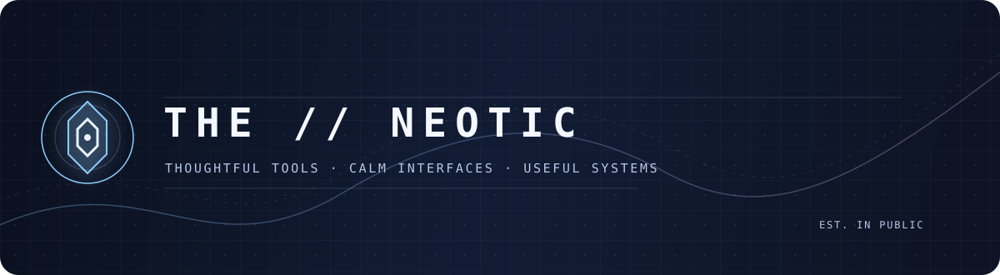
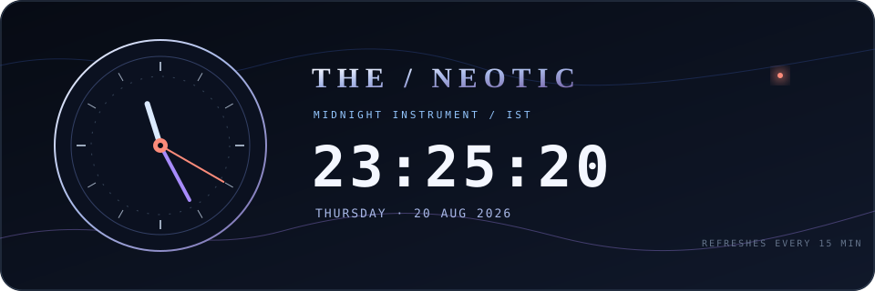

<p align="center">
  
</p>

<p align="center">
  <strong>Building considered digital tools from interface to infrastructure.</strong><br />
  I care about useful details: local-first thinking, clear interaction, and software that feels deliberate.
</p>

<p align="center">
  <a href="https://github.com/theneotic?tab=repositories">Explore projects</a>
  &nbsp;·&nbsp;
  <a href="https://github.com/theneotic/Monolith-Vault">Monolith Vault</a>
  &nbsp;·&nbsp;
  <a href="https://github.com/theneotic/tight-secure">Tight Secure</a>
</p>

---

## About Me

```ts
const the = {
  role: "Interface-focused builder",
  currentlyBuilding: ["Monolith Vault", "thoughtful web experiences"],
  drawnTo: ["local-first tools", "clear interaction", "useful details"],
  workingStyle: "calm, practical, and deliberate",
  principle: "Make the important signal easy to find."
} as const;
```

## Midnight Desk

<p align="center"></p>

<p align="center">
  
</p>

<p align="center"><sub>LIVE FROM MUMBAI / INDIA &nbsp;·&nbsp; MIDNIGHT INSTRUMENT SERIES</sub></p>

## Contribution Run

<p align="center"></p>

<p align="center"><sub>A small game built from the real contribution graph.</sub></p>

## Selected work

| Project | Focus | Built with |
|---|---|---|
| [**Monolith Vault**](https://github.com/theneotic/Monolith-Vault) | A local-first password intelligence workspace with contextual scoring, a password builder, a tutorial lens, palette control, and an accessible Low motion preference. | TypeScript · React · Vite |
| [**Tight Secure**](https://github.com/theneotic/tight-secure) | A TypeScript password-security project in the Monolith Vault project line. | TypeScript |

## Current workbench

<table>
  <tr>
    <td width="50%" valign="top">
      <h3>01 — Product craft</h3>
      <p>I build interfaces that make complex decisions feel understandable, calm, and direct.</p>
    </td>
    <td width="50%" valign="top">
      <h3>02 — Practical systems</h3>
      <p>I am interested in tools with a real job to do: privacy-aware utilities, media experiences, and reliable everyday workflows.</p>
    </td>
  </tr>
</table>

## Working principles

```text
01  Start with the real use case.
02  Make the important signal easy to find.
03  Prefer durable, local-first decisions when possible.
04  Polish interaction until the tool feels intentional.
```

## Tech Stack

<p align="center"><sub>INTERFACE &amp; WEB</sub></p>
<p align="center">
  <a href="https://www.typescriptlang.org/docs/"></a>
  <a href="https://react.dev/"></a>
  <a href="https://vite.dev/"></a>
  <a href="https://developer.mozilla.org/docs/Web/HTML"></a>
  <a href="https://developer.mozilla.org/docs/Web/CSS"></a>
</p>

<p align="center"><sub>MOBILE &amp; SYSTEMS</sub></p>
<p align="center">
  <a href="https://kotlinlang.org/"></a>
  <a href="https://developer.android.com/"></a>
  <a href="https://www.gnu.org/software/bash/"></a>
</p>

<p align="center"><sub>WORKFLOW</sub></p>
<p align="center">
  <a href="https://git-scm.com/doc"></a>
  <a href="https://docs.github.com/"></a>
</p>

## Signals

<p align="center">
  
  
</p>

---

<p align="center">
  <sub>Browse the repositories for the work in progress.</sub>
</p>
