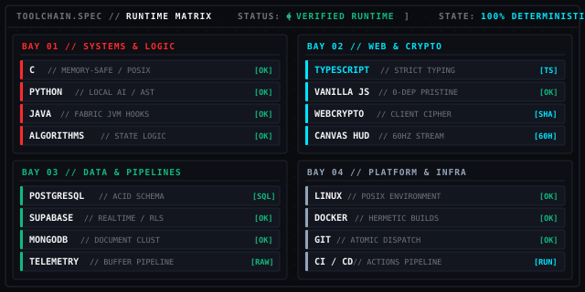

<p align="center">
  
</p>

<p align="center">
  <a href="https://github.com/theneotic?tab=repositories"></a>
  <a href="#01--architectural-standards"></a>
  <a href="#02--runtime-toolchain"></a>
  <a href="#03--verified-production-repositories"></a>
  <a href="#04--telemetry-trace"></a>
  <a href="#05--direct-directory"></a>
</p>

<br />

<a id="01--architectural-standards"></a>
## 01 // ARCHITECTURAL STANDARDS

Every repository across this profile is engineered as verifiable proof of first-principles systems thinking, deterministic state logic, and zero-bloat execution. No synthetic filler or framework sprawl—only inspectable source code solving concrete architectural bottlenecks.

<br />

<p align="center">
  
</p>

<br />

<p align="center">
  
</p>

<br />

<a id="02--runtime-toolchain"></a>
## 02 // SYSTEMS ARCHITECTURE &amp; RUNTIME TOOLCHAIN

<p align="center">
  
</p>

<br />

<p align="center">
  
</p>

<br />

<a id="03--verified-production-repositories"></a>
## 03 // VERIFIED PRODUCTION REPOSITORIES

> Complete inspectable source code open sourced across [github.com/theneotic?tab=repositories](https://github.com/theneotic?tab=repositories)

<table width="100%">
  <thead>
    <tr>
      <th align="center" width="33.3%"><strong>01 // MONOLITH VAULT</strong></th>
      <th align="center" width="33.3%"><strong>02 // F1 TELEMETRY HUD</strong></th>
      <th align="center" width="33.3%"><strong>03 // CLEARCUT VISION</strong></th>
    </tr>
  </thead>
  <tbody>
    <tr>
      <td align="center">
        <a href="https://github.com/theneotic/Monolith-Vault">
          
        </a>
      </td>
      <td align="center">
        <a href="https://github.com/theneotic/f1-telemetry-dashboard">
          
        </a>
      </td>
      <td align="center">
        <a href="https://github.com/theneotic/clearcut">
          
        </a>
      </td>
    </tr>
  </tbody>
</table>

<br />

<p align="center">
  
</p>

<br />

<a id="04--telemetry-trace"></a>
## 04 // TELEMETRY TRACE

<p align="center">
  <picture>
    <source media="(prefers-color-scheme: dark)" srcset="https://raw.githubusercontent.com/theneotic/theneotic/output/github-contribution-grid-snake-dark.svg" />
    <source media="(prefers-color-scheme: light)" srcset="https://raw.githubusercontent.com/theneotic/theneotic/output/github-contribution-grid-snake-dark.svg" />
    
  </picture>
</p>

<p align="center">
  <sub><code>TELEMETRY TRACE // AUTOMATED GITHUB ACTIONS DISPATCH</code></sub>
</p>

<br />

---

<br />

<a id="05--direct-directory"></a>
## 05 // DIRECT DIRECTORY

- **Source Repositories:** [github.com/theneotic](https://github.com/theneotic?tab=repositories)
- **Professional Network:** [linkedin.com/in/samir-siddiquix](https://www.linkedin.com/in/samir-siddiquix/)
- **Direct Transmission:** [samirsiddiquix@gmail.com](mailto:samirsiddiquix@gmail.com)
- **Real-Time Node:** `@alistairvalecrest` via [Discord](https://discord.gg/Zc99tAvx)

<br />

```text
┌────────────────────────────────────────────────────────────────────────┐
│  The-Neotic (@THENEOTIC) // SYSTEMS & ARCHITECTURE // BUILD 2026.10    │
│  STATUS: VERIFIED // INSPECTABLE SOURCE // ZERO-BLOAT GUARANTEE        │
└────────────────────────────────────────────────────────────────────────┘
```
